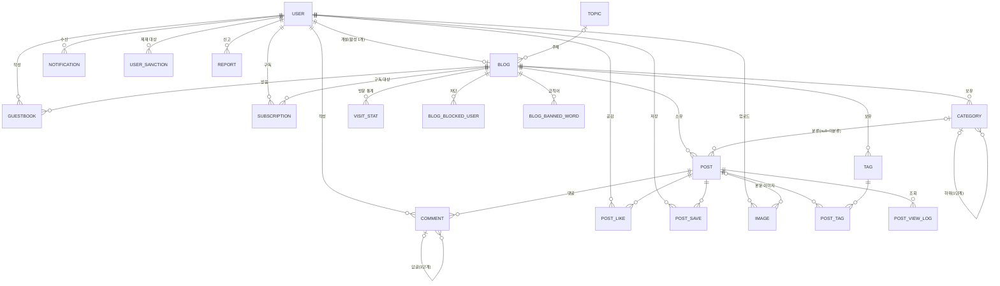

# Data Model: 티스토리형 블로그 서비스

**Feature**: [spec.md](./spec.md) | **Plan**: [plan.md](./plan.md) | **Date**: 2026-10-07

팀 ERD 기본안(`ERD.md`, 통합 기능명세서 v0.2 기준)을 이 서비스의 선택 항목에 맞춰 줄인 논리 모델이다. 타입은 MySQL 8 기준이며 H2(MySQL 모드)에서도 같다. 모든 시각은 UTC로 저장한다.

## 선택 항목에 따른 ERD 기본안과의 차이

| 선택 항목 | 결정 | ERD 기본안에서 바뀐 점 |
| --- | --- | --- |
| 로그인 방식 | 카카오 | `email`, `password_hash` 없음. `social_provider`(=KAKAO) + `social_id` 사용 |
| 회원당 블로그 수 | 1개 | `USER.primary_blog_id`, `BLOG.moved_to_blog_id`, `POST_MOVE` 없음. 활성 블로그는 회원당 하나(아래 제약) |
| 에디터 | 혼합 | `content_markdown`(원문), `content_html`(정화된 HTML), `content_text`(검색·요약용 평문)로 나눔 |
| 글 주소 | 제목 기반 | `POST.slug` 사용, `(blog_id, slug)` 유니크 |
| 주제 지정 단위 | 블로그마다 | `BLOG.topic_id` 사용, `POST.topic_id` 없음 |
| 확장 공개 범위 | 구독자 공개 | `visibility`: `PUBLIC` / `PRIVATE` / `SUBSCRIBER`. 보호글 비밀번호 칸 없음 |
| 조회수 중복 (임시 결정) | 30분 내 재방문 제외 | `POST_VIEW_LOG` 추가 |
| 중복 요청 방지 | Idempotency-Key | `IDEMPOTENCY_RECORD` 추가 |

## ERD



## 엔티티

표기: PK 기본 키, FK 외래 키, UK 유니크, NN 필수. "단계"는 처음 필요한 구현 단계(P0/P1/P2)다.

### USER (회원) — AUTH-01~06, ADMIN-01

| 필드 | 타입 | 규칙 |
| --- | --- | --- |
| id | BIGINT PK | |
| social_provider | VARCHAR(20) NN | `KAKAO` |
| social_id | VARCHAR(64) NN | `(social_provider, social_id)` UK |
| nickname | VARCHAR(30) NN | 처음 로그인 때 카카오 닉네임으로 채움 |
| profile_image_url | VARCHAR(500) | AUTH-05 (P1) |
| role | VARCHAR(10) NN | `MEMBER` / `ADMIN`. 가입 시 항상 `MEMBER`(ADMIN-01-2) |
| created_at | TIMESTAMP NN | |
| withdrawn_at | TIMESTAMP | AUTH-06 (P2). 탈퇴 시 개인정보를 비우고 '탈퇴한 회원'으로 표시 |

- 서비스 관리자 계정은 Flyway 시드나 운영 설정(`ADMIN_SOCIAL_IDS`)으로만 만든다.

### BLOG (블로그) — BLOG-01~07, POST-11, ADMIN-05

| 필드 | 타입 | 규칙 |
| --- | --- | --- |
| id | BIGINT PK | |
| owner_id | BIGINT FK→USER NN | |
| address | VARCHAR(32) UK NN | `^[a-z0-9](?:[a-z0-9-]{2,30})[a-z0-9]$`, 예약어 불가, 변경 불가, 삭제돼도 행 유지(POL-02) |
| name | VARCHAR(40) NN | 1~40자(공백 제거 후) |
| description | VARCHAR(500) | 비워 둘 수 있음 |
| profile_image_url | VARCHAR(500) | 없으면 기본 이미지 |
| topic_id | INT FK→TOPIC | null이면 '주제 없음'(POST-11, P1) |
| skin | VARCHAR(30) | BLOG-05 (P2) |
| background_image_url | VARCHAR(500) | BLOG-05 (P2) |
| restricted_at, restricted_reason | TIMESTAMP, VARCHAR(500) | ADMIN-05 (P2) |
| created_at | TIMESTAMP NN | |
| deleted_at | TIMESTAMP | BLOG-07 (P2), 소프트 삭제 |

- **회원당 활성 블로그 1개**: `active_owner_id`(= `deleted_at`이 null이면 `owner_id`, 아니면 null) 생성 칼럼에 UK를 건다. 삭제 후 다른 주소로 재개설할 수 있다(임시 결정).

### RESERVED_WORD (예약어) — POL-02-3

| 필드 | 타입 | 규칙 |
| --- | --- | --- |
| word | VARCHAR(32) PK | `www`, `api`, `admin`, `login`, `logout`, `files`, `static`, `mail`, `help`, `blog` 등. Flyway 시드 |

### TOPIC (주제) — POST-11, HOME-03

| 필드 | 타입 | 규칙 |
| --- | --- | --- |
| id | INT PK | |
| name | VARCHAR(30) UK NN | IT, 여행, 반려동물, 일상, 맛집 … (시드) |
| sort_order | INT NN | |

### CATEGORY (카테고리) — CAT-01~05

| 필드 | 타입 | 규칙 |
| --- | --- | --- |
| id | BIGINT PK | |
| blog_id | BIGINT FK→BLOG NN | |
| parent_id | BIGINT FK→CATEGORY | null이면 최상위. 부모의 parent_id는 반드시 null(한 단계, CAT-03) |
| name | VARCHAR(20) NN | `(blog_id, parent_key, name)` UK — `parent_key`는 parent_id가 null이면 0인 생성 칼럼 |
| sort_order | INT NN | CAT-04 |
| is_private | BOOLEAN NN | 기본 false, CAT-05 (P2) |

- '전체 글'과 '미분류'는 행이 아니다. `POST.category_id`가 null이면 미분류다. 그래서 이름 변경·삭제가 원래 불가능하다(CAT-01-2).
- 삭제: 하위가 있으면 거절(409). 없으면 한 트랜잭션에서 소속 글의 `category_id`를 null로 바꾸고 행을 지운다(POL-07-3, NFR-11).

### POST (글) — POST-01~13, ADMIN-03

| 필드 | 타입 | 규칙 |
| --- | --- | --- |
| id | BIGINT PK | |
| blog_id | BIGINT FK→BLOG NN | |
| category_id | BIGINT FK→CATEGORY | null = 미분류 |
| slug | VARCHAR(100) | 처음 발행할 때 고정. `(blog_id, slug)` UK. 임시저장 글은 null |
| title | VARCHAR(100) NN | 발행 시 1~100자(공백 제거 후) |
| content_markdown | MEDIUMTEXT NN | 원문 |
| content_html | MEDIUMTEXT NN | 서버에서 렌더링·정화한 HTML |
| content_text | MEDIUMTEXT NN | 태그를 뺀 평문. 검색·요약용 |
| thumbnail_url | VARCHAR(500) | POST-07 (P1). null이면 본문 첫 이미지 |
| visibility | VARCHAR(12) NN | `PUBLIC`(기본) / `PRIVATE` / `SUBSCRIBER`(P2) |
| status | VARCHAR(12) NN | `DRAFT` / `SCHEDULED` / `PUBLISHED` |
| comment_allowed | BOOLEAN NN | 기본 true, CMT-07 (P2) |
| scheduled_at | TIMESTAMP | POST-13 (P2) |
| published_at | TIMESTAMP | 처음 실제 공개된 시각. 수정해도 불변 |
| hidden_at, hidden_reason | TIMESTAMP, VARCHAR(500) | ADMIN-03 (P1) |
| created_at, updated_at | TIMESTAMP NN | |

**상태 전이**

```text
(새 글) ──임시저장──▶ DRAFT ──발행──▶ PUBLISHED
                        │                ▲
                        └──예약──▶ SCHEDULED ──예약 시각 도달(스케줄러)──┘
PUBLISHED ──삭제──▶ (행 삭제, 연쇄 삭제)
관리자 숨김은 상태와 별개: hidden_at 설정/해제 (해제하면 그대로 원상복구)
```

- 발행할 때 slug와 published_at을 정하고, 이후 바꾸지 않는다(POL-03-1, POST-02-2).
- 임시저장(DRAFT)은 회원당 블로그에서 여러 개 가능하며, 같은 글을 발행하면 그 DRAFT 행이 PUBLISHED로 바뀐다(POST-08-3).
- **목록 정렬**: `published_at DESC, id DESC`.
- **볼 수 있는지 판단 순서**(POST-04-2, `PostAccessPolicy`): ① 글 존재 ② 주소의 블로그 소속 ③ 블로그 삭제·이용 제한 아님 ④ 관리자 숨김 아님 ⑤ 블로그 주인이면 통과 ⑥ status = PUBLISHED ⑦ visibility가 PUBLIC, 또는 SUBSCRIBER이면서 보는 사람이 구독자 ⑧ 카테고리가 비공개 아님. 하나라도 실패하면 404. (④는 글쓴이 본인에게만 숨김 사실과 사유를 보여 준다.)
- **삭제**: 한 트랜잭션에서 COMMENT, POST_LIKE, POST_SAVE, POST_TAG, POST_VIEW_LOG, NOTIFICATION을 지운 뒤 POST를 지운다(POL-07-1, NFR-11). IMAGE는 post_id만 null로 두고 정리 작업에서 지운다.

### TAG, POST_TAG (태그) — TAG-01~04

| 엔티티 | 필드 | 규칙 |
| --- | --- | --- |
| TAG | id BIGINT PK, blog_id FK NN, name VARCHAR(30) NN | `(blog_id, name)` UK. 대소문자 그대로 저장하되 비교는 소문자로 |
| POST_TAG | post_id FK, tag_id FK | 복합 PK. 글당 최대 10개(서비스에서 검사) |

### IMAGE (이미지) — POST-05, POST-07, BLOG-02, AUTH-05

| 필드 | 타입 | 규칙 |
| --- | --- | --- |
| id | BIGINT PK | |
| uploader_id | BIGINT FK→USER NN | |
| post_id | BIGINT FK→POST | 본문 이미지면 글, 아니면 null |
| original_path | VARCHAR(300) NN | 방향을 바로 세운 원본 |
| thumb_path | VARCHAR(300) NN | 가로 400px(GIF는 원본과 같음) |
| mime_type | VARCHAR(20) NN | `image/jpeg` / `image/png` / `image/gif` / `image/webp` (매직 바이트로 판별) |
| size_bytes | INT NN | 10MB 이하 |
| width, height | INT NN | |
| created_at | TIMESTAMP NN | |

### COMMENT (댓글) — CMT-01~07, ADMIN-03

| 필드 | 타입 | 규칙 |
| --- | --- | --- |
| id | BIGINT PK | |
| post_id | BIGINT FK→POST NN | |
| author_id | BIGINT FK→USER NN | 회원만(비회원 댓글 없음) |
| parent_id | BIGINT FK→COMMENT | CMT-05 (P2), 부모의 parent_id는 null |
| content | VARCHAR(1000) NN | 1~1,000자, 평문으로 저장하고 출력 시 이스케이프 |
| is_secret | BOOLEAN NN | 기본 false, CMT-06 (P2) |
| hidden_at, hidden_reason | TIMESTAMP, VARCHAR(500) | ADMIN-03 (P1) |
| created_at, updated_at | TIMESTAMP NN | 작성순 정렬 = `created_at ASC, id ASC` |
| deleted_at | TIMESTAMP | 답글이 있으면 소프트 삭제('삭제된 댓글'), 없으면 행 삭제 |

### GUESTBOOK (방명록) — CMT-04 (P1)

| 필드 | 타입 | 규칙 |
| --- | --- | --- |
| id | BIGINT PK | |
| blog_id | BIGINT FK→BLOG NN | |
| author_id | BIGINT FK→USER NN | |
| content | VARCHAR(1000) NN | 1~1,000자 |
| created_at | TIMESTAMP NN | |

### POST_LIKE, POST_SAVE — SOC-01, SOC-03

| 엔티티 | 필드 | 규칙 |
| --- | --- | --- |
| POST_LIKE | user_id FK, post_id FK, created_at | 복합 PK → 회원당 글마다 한 번. 자기 글 공감 불가(서비스 검사, 임시 결정) |
| POST_SAVE | user_id FK, post_id FK, created_at | 복합 PK (P2) |

### POST_VIEW_LOG — POST-09 (P1)

| 필드 | 타입 | 규칙 |
| --- | --- | --- |
| id | BIGINT PK | |
| post_id | BIGINT FK→POST NN | |
| viewer_key | CHAR(64) NN | 회원 id 또는 비회원 쿠키 값의 SHA-256 |
| viewed_at | TIMESTAMP NN | `(post_id, viewer_key, viewed_at)` 인덱스 |

- 조회수 = 기록 행 수. 같은 viewer_key의 30분 안 재조회는 기록하지 않는다.

### SUBSCRIPTION — SUB-01~03, SUB-05

| 필드 | 타입 | 규칙 |
| --- | --- | --- |
| subscriber_id | BIGINT FK→USER | 복합 PK |
| blog_id | BIGINT FK→BLOG | 복합 PK. 자기 블로그 불가(서비스 검사) |
| created_at | TIMESTAMP NN | |

- 맞구독(SUB-05)은 테이블 없이 반대 방향 행이 있는지로 계산한다.

### NOTIFICATION — SUB-04 (P2)

| 필드 | 타입 | 규칙 |
| --- | --- | --- |
| id | BIGINT PK | |
| user_id | BIGINT FK→USER NN | 받는 사람 |
| type | VARCHAR(20) NN | `COMMENT` / `LIKE` / `SUBSCRIBE` / `NEW_POST` |
| actor_id | BIGINT FK→USER NN | 받는 사람과 같으면 만들지 않음 |
| blog_id, post_id, comment_id | BIGINT FK | 관련 대상. 글 삭제 시 함께 삭제 |
| is_read | BOOLEAN NN | |
| created_at | TIMESTAMP NN | |

### 관리 엔티티 — ADMIN-02~06, MNG-03·04

| 엔티티 | 주요 필드 | 규칙 |
| --- | --- | --- |
| USER_SANCTION (P1) | id, user_id, admin_id, reason, starts_at, ends_at(null=영구), released_at | 제한 중 = `starts_at <= now < COALESCE(ends_at, ∞)` 그리고 `released_at IS NULL`. 관리자는 관리자를 제재할 수 없다 |
| ADMIN_LOG (P1부터 기록) | id, admin_id, action, target_type, target_id, reason, created_at | 추가만 가능, 수정·삭제 API 없음(ADMIN-06) |
| REPORT (P2) | id, reporter_id, target_type(POST/COMMENT), target_id, reason_code, status(PENDING/HIDDEN/REJECTED), handled_by, created_at, handled_at | `(reporter_id, target_type, target_id)` UK, 자기 것 신고 불가 |
| NOTICE (P2) | id, admin_id, title, content, created_at | |
| VISIT_STAT (P2) | blog_id, visit_date, visitor_count | 복합 PK |
| BLOG_BLOCKED_USER (P2) | blog_id, user_id, created_at | 복합 PK |
| BLOG_BANNED_WORD (P2) | id, blog_id, word | `(blog_id, word)` UK |

### IDEMPOTENCY_RECORD — NFR-08

| 필드 | 타입 | 규칙 |
| --- | --- | --- |
| user_id | BIGINT | 복합 PK |
| idem_key | CHAR(36) | 복합 PK (UUID) |
| request_hash | CHAR(64) NN | 같은 키로 다른 내용을 보내면 422 |
| response_status, response_body | INT, TEXT | 처음 응답을 그대로 돌려줌 |
| created_at | TIMESTAMP NN | 24시간 지나면 정리 |

## 개수 계산

공감 수, 댓글 수, 구독자 수, 글 수, 카테고리별 글 수는 저장하지 않고 보는 사람 기준으로 COUNT 한다(POL-04-5, NFR-09). 성능이 문제가 되면 그때 캐시 칼럼을 추가하고 같은 트랜잭션에서 갱신한다.
